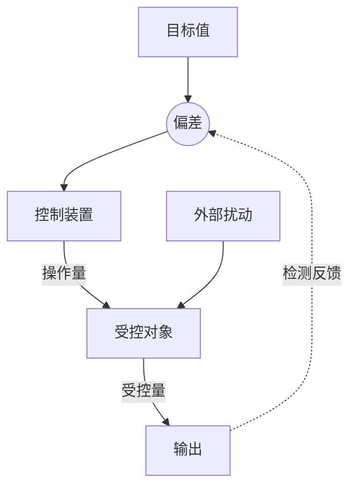

# 引言
控制论的哲学观：
$$
\text{人类发展}\begin{cases}
\text{认识世界}\\
\text{改造世界}
\end{cases}\xrightarrow{\text{迁移}}\text{数学}\begin{cases}
\text{建模}\\
\text{控制}
\end{cases}
$$
如何“多快好省”地改造世界就是最优控制问题。
控制理论研究的对象称为系统。例如，一部蒸汽机是一个系统，一个加热炉是一个系统，一个工厂是一个系统，某种产品的生产和销售体系是一个系统，等等。

若根据某个给定的指令操纵系统的某个物理量（称为受控量），使之发生变化，则称这些指令是控制。这里所说的指令是指一种信息，而不是指使系统动作的能源。如果所说的指令是由某种机械或仪表来实现的，而不是直接由人们给定的，则称这种控制为自动控制。

# 状态空间方程

>[!example]
>title:贮槽液位
>考虑一个带有进水管道和出水管道的贮槽（水箱）：
>
>- **进水管道**：流量 $Q_1$ 可由调节阀控制
>- **出水管道**：安装在贮槽下部，截面积固定为 $F$
>- **贮槽截面积**：$s$（常数）
>- **液位高度**：$h$（受控量）
>
>![[Pasted image 20260612145003.png]]
>目标是：通过控制进水流量 $Q_1$，使液位 $h$ 维持在期望值附近。出水流量 $Q_2$ 并非独立控制，而是由液位高度 $h$ 决定——液位越高，出水越快。模型方程为
>$$
>T \frac{d(\Delta h)}{dt} + \Delta h = K \Delta Q_1 + K_1 \Delta F\tag{1}
>$$

>[!example]
>title:阻容电路
>考虑一个由电阻 $R$、电容 $C$ 和电源 $E$ 串联而成的简单电路（RC电路）：
>
>- **电阻** $R$：消耗电能，产生电压降
>- **电容** $C$：储存电荷，两端产生电压
>- **电源** $E(t)$：输入电压（控制量），可随时间变化
>- **电容电压** $x(t)$：输出电压（受控量）
>
>![[Pasted image 20260612145337.png]]
>目标是：通过控制输入电压 $E(t)$，使电容两端的电压 $x(t)$ 按期望方式变化。模型方程为
>$$
>T\frac{dx}{dt}+x=KE(t)\tag{2}
>$$

>[!example]
>title:二阶阻容电路
>考虑一个由两个电阻、两个电容和电源组成的二阶电路：
>
>- **电阻**：$R_1$​、$R_2$​
>- **电容**：$C_1$​、$C_2$​
>- **电源**：$E(t)$（输入电压，控制量）
>- **节点A**：三个支路的交汇点
>
>电路连接方式：
>
>- 电源 $E(t)$ 与电阻 $R_1$​ 串联
>- $R_1$​ 的另一端连接节点 A
>- 从节点 A 分两条支路：
>  - 支路1：电容 $C_1$​ → 回到电源负极
>  - 支路2：电阻 $R_2$​ → 电容 $C_2$​ → 回到电源负极
>
>![[Pasted image 20260612145824.png]]
>
>**输出/受控量**：通常取电容 $C_2$​ 两端的电压 $x_2(t)$。模型方程为
>$$
>\begin{cases}
>\dfrac{\mathrm{d}x_1(t)}{\mathrm{d}t} + \dfrac{1}{C_1}\left(\dfrac{1}{R_1} + \dfrac{1}{R_2}\right)x_1(t) - \dfrac{1}{R_2C_1}x_2(t) = \dfrac{1}{R_1C_1}E(t), \\[1em]
>\dfrac{\mathrm{d}x_2(t)}{\mathrm{d}t} - \dfrac{1}{R_2C_2}x_1(t) + \dfrac{1}{R_2C_2}x_2(t) = 0.
>\end{cases}\tag{3}
>$$
我们将前面所讨论的例子中的变量分为三类：第一类称为**输入变量**，如液位系统的进水量、阻容电路中电源的电势，这些量可以人为确定；第二类称为**输出变量**，是系统可以测量的结果变量，如液位系统的液位高度与目标值的差、阻容电路的输出电压；第三类称为**状态变量**，是为了描述系统的动态过程而引入的变量，它们中有一部分可能是输出变量

输入变量和输出变量又称为**外部变量**，而状态变量则称为**内部变量**。
>[!def] 各类变量
>- 输入变量（控制）：$u(t)=\left(u_1(t),\cdots,u_m(t)\right)$
>- 输出变量：$y(t)=(y_1(t),\cdots,y_r(t))$
>- 状态变量：$x(t)=(x_1(t),\cdots,x_m(t))$

>[!def] 状态空间方程
>我们用一阶ODE来描述控制系统，这个方法称为状态空间法。
>$$
>\begin{cases}
>\frac{dx_j(t)}{dt}=f_j(t,x_1(t),\cdots,x_n(t),u_1(t),\cdots,u_m(t)),&j=1,\cdots,n\\
>y_k(t)=g_k(t,x_1(t),\cdots,x_n(t),u_1(t),\cdots,u_m(t)),&k=1,\cdots,r
>\end{cases}
>$$
>也可以写成向量形式
>$$
>\begin{cases}
>\frac{dx(t)}{dt}=f(t,x(t),u(t))\\
>y(t)=g(t,x(t),u(t))
>\end{cases}\tag{4}
>$$

>[!def] 线性系统
>当$f(t,x(t),u(t))=A(t)x(t)+B(t)u(t),g(t,x(t),u(t))=C(t)x(t)+D(t)u(t)$，此时方程(4)成为线性系统
>$$
>\begin{cases}
>\frac{dx(t)}{dt}=A(t)x(t)+B(t)u(t)\\
>y(t)=C(t)x(t)+D(t)u(t)
>\end{cases}\tag{5}
>$$
>若矩阵$A(t),B(t),C(t),D(t)$都为常值矩阵$A,B,C,D$，称方程(5)为线性定常系统。

>[!note] 求解方程(5)
>我们考虑状态方程的非齐次线性ODE
>$$
>\begin{cases}
>\frac{dx(t)}{dt}=A(t)x(t)+B(t)u(t)\\
>x(t_0)=x_0
>\end{cases}
>$$
>其中$(A(t))_{n\times n},(B(t))_{n\times m}$为矩阵，求解该方程。

**Solution**
方程的解为
$$
x(t)=e^{\int_{t_0}^{t}A(s){d}s}\left[x_0+\int_{t_0}^{t}B(s)u(s)e^{-\int_{t_0}^{s}A(u){d}u}{d}s\right]\tag{6}
$$
**QED**
# 能控性简介
对系统施加控制是为了实现人们的某种既定的目标。能否选择适当的控制把系统从一个初始状态转移到另一个给定的状态，是控制理论所研究的基本问题之一，称之为**能控性问题**。我们考虑线性定常系统，
$$
\begin{cases}
\frac{dx(t)}{dt}=Ax(t)+Bu(t)\\
x(0)=x_0
\end{cases}\tag{$[A,B]$}
$$
根据结果(6)解得
$$
x(t;x_0,u(\cdot))=e^{At}\left[x_0+\int_{t_0}^{t}e^{A(t-s)}Bu(s){d}s\right]
$$
>[!def] 能达性
>对于 $x_1 \in \mathbb{R}^n$，如果存在控制作用 $u(\cdot)$ 和时刻 $\tau > 0$，使得 $$ x(\tau; 0, u(\cdot)) = x_1, $$ 那么就称 $x_1$ 是系统 $[A,B]$ 的一个**能达状态**。如果任意的 $x_1 \in \mathbb{R}^n$ 都是系统 $[A,B]$ 的能达状态，那么称系统 $[A,B]$ 是**能达的**。

>[!def] 能控性
>对于 $x_0 \in \mathbb{R}^n$，如果存在控制作用 $u(\cdot)$ 和时刻 $\tau > 0$，使得 $$ x(\tau; x_0, u(\cdot)) = 0, $$ 那么就称 $x_0$ 是系统 $[A,B]$ 的一个**能控状态**。如果任意的 $x_0 \in \mathbb{R}^n$ 都是系统 $[A,B]$ 的能控状态，那么称系统 $[A,B]$ 是**能控的**。

>[!thm]
>系统$[A,B]$的能达性和能控性等价。

>[!thm] Kalman秩条件
>系统$[A,B]$能控或能达的充分条件为
>$$
>\text{rank}\left(B,AB,A^2B,\cdots,A^{n-1}B\right)=n
>$$

>[!thm] 
>若系统$[A,B]$能达或能控，则对任意给定的$\tau>0,x_0,x_1\in\mathbb{R}^n$, 存在控制$u(\cdot)$使得
>$$
>x(\tau;x_0,u(\cdot))=x_1
>$$

# 能观性简介 
根据系统的输出和输入来确定系统的状态，是控制理论中的另一个基本问题，称之为系统的**能观性问题**。我们考虑系统
$$
\begin{cases}
\frac{dx(t)}{dt}=Ax(t)+Bu(t)\\
y(t)=Cx(t)
\end{cases}\tag{$[A,B,C]$}
$$
>[!def] 完全能观
若存在某时刻$t_1\ge0$, 使得根据$[0,t_1]$上的输出$y(t)$和控制$u(t)$能唯一确定初始状态$x_0$, 则称系统能观。

>[!def] 对偶系统
>系统$[A,B,C]$的对偶系统为
>$$
>\begin{cases}
>\frac{d\varphi(t)}{dt}=-A^\top \varphi(t)+C^\top u(t)\\
>\psi(t)=B^\top \varphi(t)
>\end{cases}\tag{$[-A^\top,B^\top,C^\top]$}
>$$

>[!thm] 系统能观的充要条件
系统$[A,B,C]$能观当且仅当其对偶系统能控。

